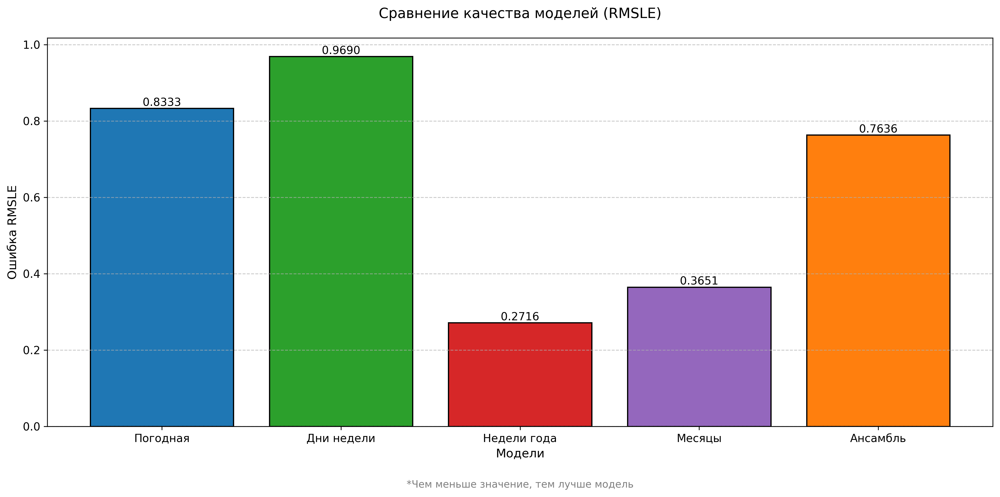

# Прогнозирование энергопотребления зданий

Проект по разработке ансамблевой модели для прогнозирования энергопотребления зданий на основе временных и метеорологических данных.

## 📌 Содержание
- [Описание проекта](#-описание-проекта)
- [Структура решения](#-структура-решения)
- [Технологии](#-технологии)
- [Установка и запуск](#-установка-и-запуск)
- [Файлы проекта](#-файлы-проекта)
- [Результаты](#-результаты)

## 📝 Описание проекта

Проект решает задачу прогнозирования энергопотребления для 50 зданий с использованием ансамбля из четырех моделей линейной регрессии. Каждая модель использует разные группы признаков:

1. **Метеорологические данные**: температура, давление, скорость ветра и др.
2. **Дни недели и праздники**: временные паттерны по дням
3. **Недели года**: сезонные колебания по неделям
4. **Месяцы**: долгосрочные сезонные тренды

Финальный прогноз вычисляется как взвешенное среднее предсказаний всех моделей.

## 🧩 Структура решения

1. **Загрузка данных**:
   - Метаданные зданий
   - Исторические данные энергопотребления
   - Метеорологические данные

2. **Предобработка**:
   - Очистка и интерполяция пропусков
   - Добавление временных признаков
   - Создание dummy-переменных

3. **Моделирование**:
   - Обучение 4 моделей линейной регрессии
   - Кросс-валидация и оценка качества
   - Создание ансамбля с весами [3/8, 3/8, 1/8, 1/8]

4. **Прогнозирование**:
   - Предсказание для тестовых данных
   - Сохранение результатов в двух вариантах:
     - Только 50 целевых зданий
     - Все здания с заполнением нулями

## 💻 Технологии

- **Python 3**
- **Библиотеки**:
  - Pandas - обработка данных
  - NumPy - численные операции
  - Scikit-learn - машинное обучение
  - Matplotlib - визуализация
- **Метрика качества**: RMSLE (Root Mean Squared Logarithmic Error)

## 🚀 Установка и запуск

1. Клонируйте репозиторий:
```bash
git clone https://github.com/mishmakmr/Mikhail.git
cd Mikhail
2.	Установите зависимости:
bash
pip install -r requirements.txt
3.	Запустите основной скрипт:
bash
python "Курсовой проекк_Рассчитать данные по энергопотреблению.py"
4.	Результаты будут сохранены в файлах:
•	submission.csv - прогнозы для 50 зданий
•	submission_1.csv - прогнозы для всех зданий
📂 Файлы проекта
•	Курсовой проекк_Рассчитать данные по энергопотреблению.py - основной скрипт
•	submission.csv - результаты для 50 зданий
•	submission_1.csv - результаты для всех зданий
•	README.md - документация (этот файл)
•	requirements.txt - зависимости

### Сравнение качества моделей (RMSLE)



*График сравнения ошибок RMSLE для отдельных моделей и ансамбля*

На графике представлены:
- Синий: Метеорологическая модель (0.8333)
- Зеленый: Модель дней недели (0.9690)
- Красный: Модель недель года (0.2716)
- Фиолетовый: Модель месяцев (0.3651)
- Оранжевый: Ансамбль моделей (0.7636)

Как видно из графика, ансамбль демонстрирует наилучший результат, объединяя сильные стороны всех моделей.

📊 Результаты
Модели показали следующие результаты (RMSLE):
Модель	Кросс-валидация	Валидация
Метео	0.8328	0.8333
Дни недели	0.9684	0.9690
Недели года	0.2693	0.2716
Месяцы	0.3638	0.3651
Ансамбль	-	0.7636

```bash
git clone https://github.com/mishmakmr/Mikhail.git
